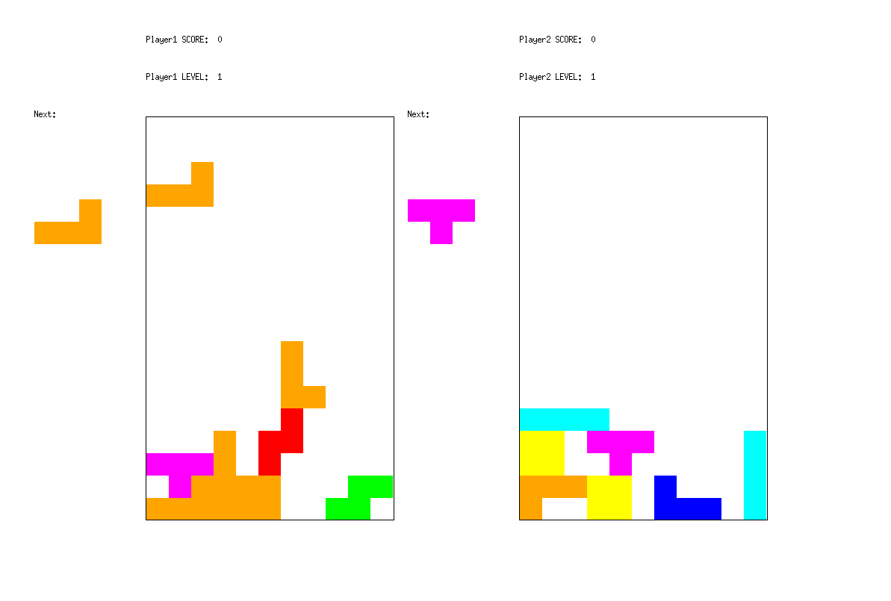

# 2 Player Tetris Project
A 2 player tetris game incorporating object oriented design princaples and design patterns.
For more infromation, please read: [project description](documents/project_description.pdf)
To see extra flags: [assignment description](documents/biquadris.pdf)
## UW CS246 F19 Final Project 
Created for CS246, Object-Oriented Software Development in Fall term of 2019.

## Group Members
- [Andy Yang](https://github.com/aydna)
- [Botao Wei](https://github.com/BotaoWei26)
- Ethan O'Farrell

## Commands

```sh
make
./biquadris.exe -text
```

